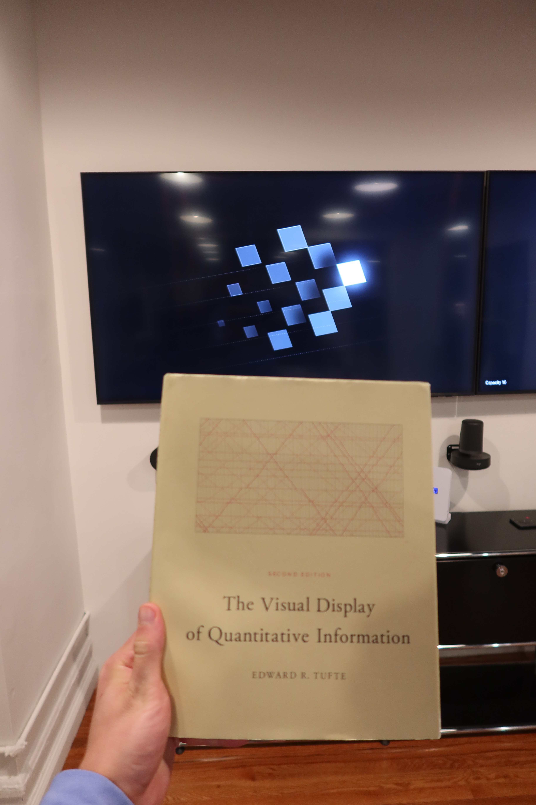

# tufte-viz



Data visualization skill for AI coding agents based on Edward Tufte's principles from *The Visual Display of Quantitative Information*, *Envisioning Information*, *Visual Explanations*, and *Beautiful Evidence*.

## Install

```bash
npx skills add pjsny/tufte-viz
```

## What it does

Gives your AI agent deep knowledge of Tufte's data visualization principles so it can:

- **Design** new visualizations with maximum data-ink ratio and zero chartjunk
- **Critique** existing charts, dashboards, and reports for graphical integrity
- **Write code** with library-specific Tufte configs for Recharts, Chart.js, matplotlib, Plotly, ECharts, and D3/SVG
- **Detect anti-patterns** like pie charts, dual y-axes, legends, rainbow palettes, and heavy gridlines
- **Apply** the Lie Factor, small multiples, sparklines, layering, and micro/macro design

## What's included

### Theory (why)

| Source | Topics |
|--------|--------|
| *Visual Display of Quantitative Information* | Data-ink ratio, chartjunk, graphical integrity, lie factor, small multiples, data density |
| *Envisioning Information* | Layering & separation, micro/macro design, escaping flatland, 1+1=3 effect |
| *Visual Explanations* | Cause & effect, confections, parallelism, narrative graphics |
| *Beautiful Evidence* | Six principles of analytical design, sparklines, range-frames, dot-dash plots |

### Practice (how)

| File | What it covers |
|------|---------------|
| Implementation guide | 22 universal rules, color/typography reference, chart type guidance, validation checklist |
| Anti-patterns | Detection table with per-library fix patterns |
| Recharts rules | React component configs, custom tooltip, small multiples layout |
| Chart.js rules | Defaults registration, datalabels plugin, dark mode |
| matplotlib rules | Spine removal, rcParams, seaborn override |
| Plotly rules | Layout template, Plotly Express shorthand |
| ECharts rules | Theme registration, endLabel direct labeling |
| D3/SVG rules | CSS defaults, inline sparkline generator, accessibility |

## License

MIT
